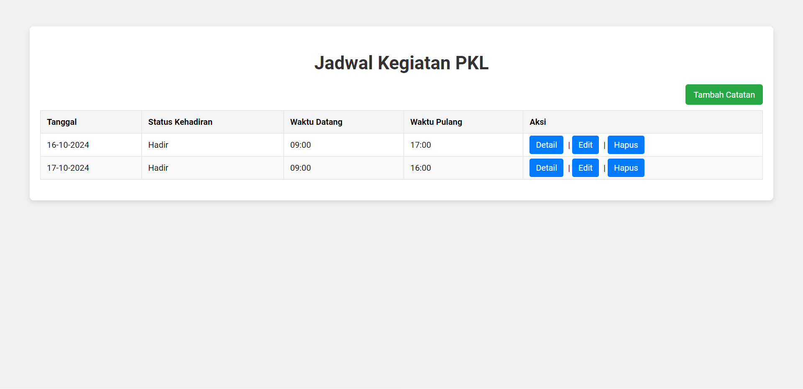
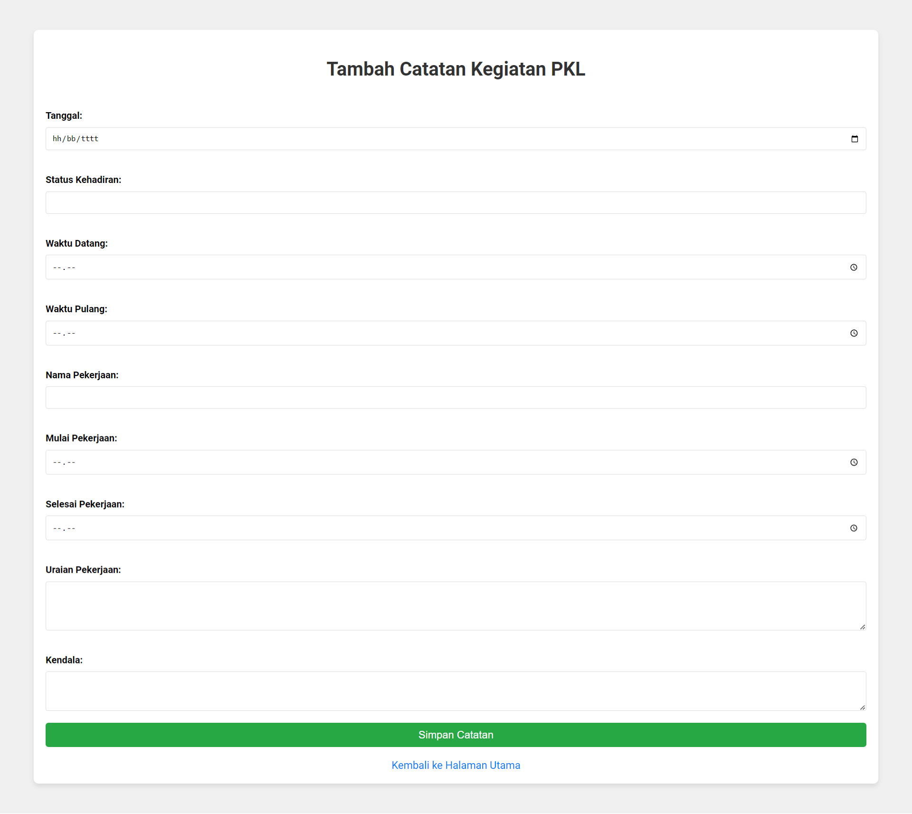
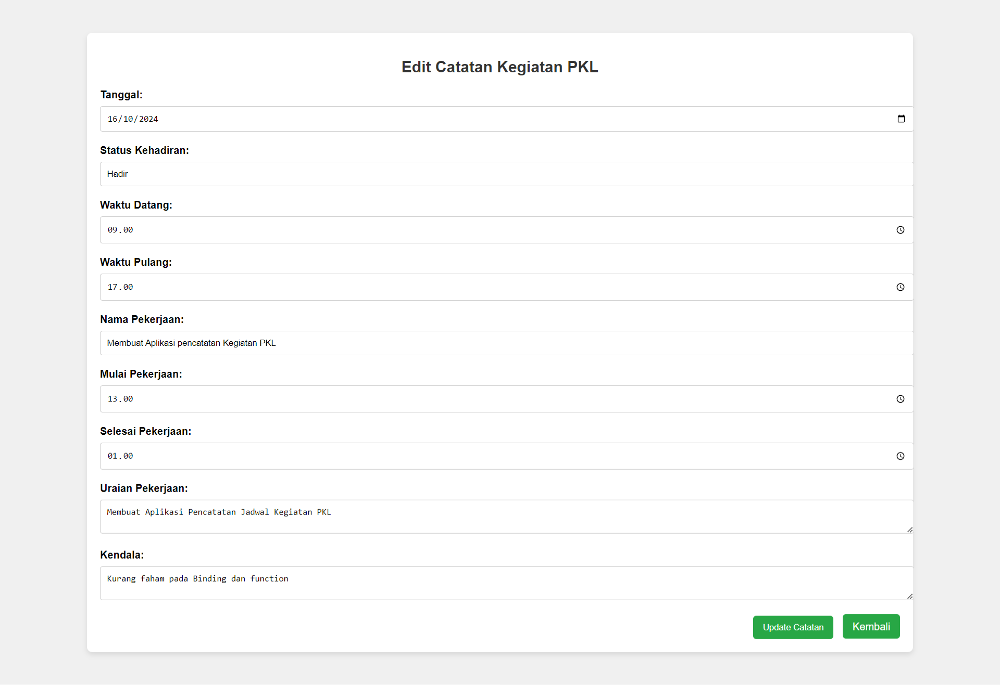
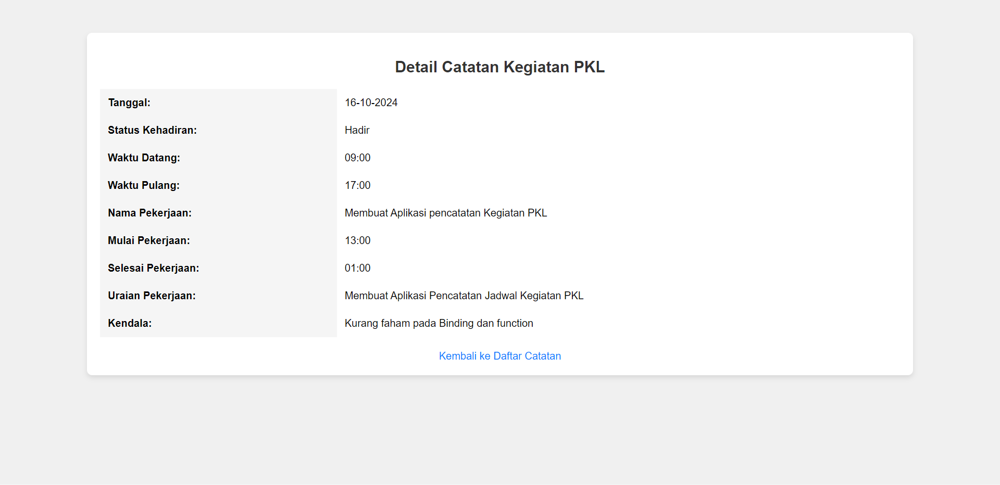

# 📊 Aplikasi Pencatatan PKL 📋

Selamat datang di **Aplikasi Pencatatan PKL**! 🎉  
Aplikasi ini dirancang untuk membantu pengguna dalam mencatat kegiatan dan kehadiran selama Program Kerja Lapangan (PKL). Pengguna dapat mencatat kegiatan harian mereka, melacak kehadiran, serta menyimpan detail waktu masuk, pulang, dan aktivitas pekerjaan yang dilakukan. 

## 🚀 Fitur Utama

- **Pencatatan Kehadiran**: Pengguna dapat mencatat waktu masuk dan pulang selama PKL, lengkap dengan status kehadiran.
- **Catatan Harian Pekerjaan**: Pengguna dapat mencatat nama pekerjaan, waktu mulai dan selesai, serta detail uraian dan kendala pekerjaan setiap hari.
- **Pengelolaan Data**: Data kegiatan dan kehadiran dikelola dengan teknologi **SQLite** yang memungkinkan penyimpanan dan pengelolaan data yang efisien.
- **Fleksibel dan Mudah**: Pengguna dapat menambahkan, mengedit, dan menghapus catatan PKL dengan mudah.

## 📚 Teknologi yang Digunakan

Proyek ini dibangun menggunakan teknologi berikut:

- **HTML5**: Untuk struktur halaman aplikasi yang user-friendly.
- **CSS3**: Untuk desain tampilan aplikasi yang responsif dan menarik.
- **PHP**: Sebagai bahasa backend untuk pengelolaan logika aplikasi dan operasi database.
- **SQLite**: Sebagai basis data lokal untuk menyimpan informasi catatan harian pengguna.

## 💻 Dokumentasi

### Halaman Utama
Ini adalah halaman utama aplikasi, di mana pengguna dapat melihat catatan PKL yang telah dibuat, serta opsi untuk menambahkan, mengedit, atau menghapus catatan.

--------------------------------------------------------

### Halaman Tambah Catatan
Pengguna dapat menambahkan catatan PKL harian, termasuk tanggal, status kehadiran, waktu datang, pulang, dan detail pekerjaan.

--------------------------------------------------------

### Halaman Edit Catatan
Pengguna dapat mengedit atau memperbarui catatan PKL yang sudah ada.

--------------------------------------------------------

### Halaman Detail Catatan
Pengguna dapat melihat rincian lengkap dari catatan yang sudah mereka buat, termasuk uraian pekerjaan dan kendala yang dihadapi.

--------------------------------------------------------

## 🔧 Cara Menggunakan

1. **Menambahkan Catatan**: Klik tombol "Tambah Catatan" pada halaman utama dan isi semua detail yang diperlukan.
2. **Mengedit Catatan**: Klik tombol "Edit" di samping catatan yang ingin diperbarui, lalu simpan perubahan.
3. **Menghapus Catatan**: Klik tombol "Hapus" di samping catatan yang tidak lagi diperlukan.
4. **Melihat Detail Catatan**: Klik judul catatan untuk melihat informasi lebih detail.

## 🎯 Tujuan Aplikasi

Aplikasi ini bertujuan untuk mempermudah peserta PKL dalam mencatat kegiatan harian mereka secara terstruktur, serta memantau kehadiran dan progress pekerjaan selama program berlangsung.

## 🙏 Terima Kasih!

Terima kasih telah menggunakan **Aplikasi Pencatatan PKL**. Jangan lupa untuk memberikan masukan dan feedback agar aplikasi ini semakin bermanfaat bagi banyak orang. 😊
